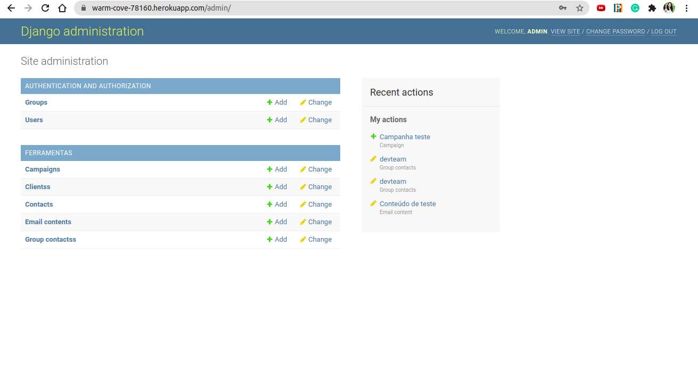
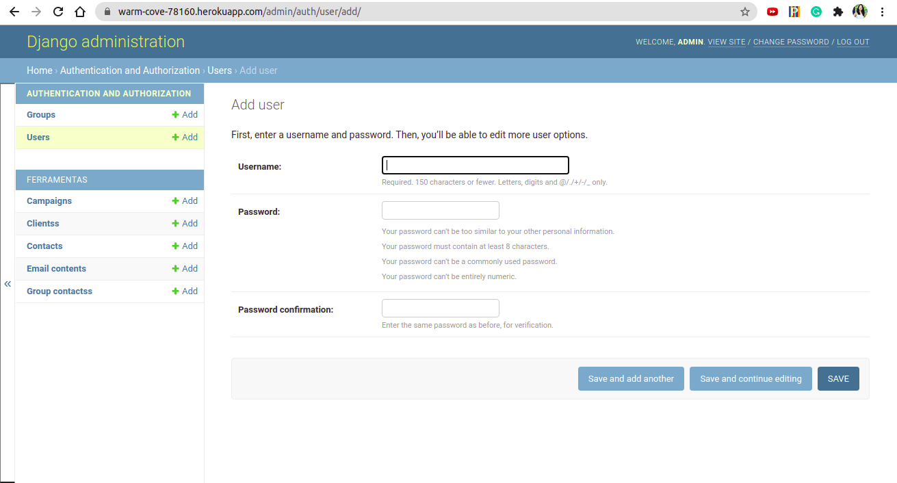
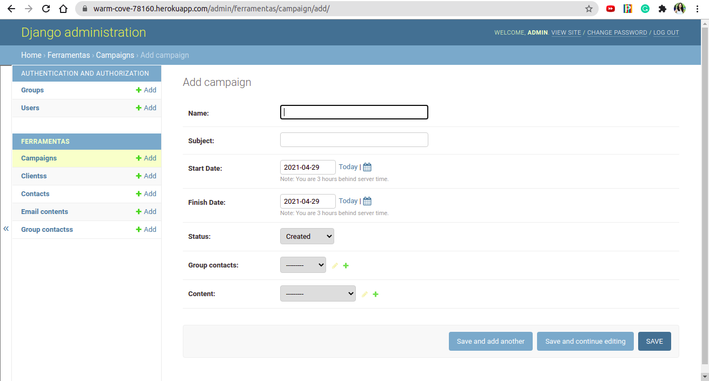
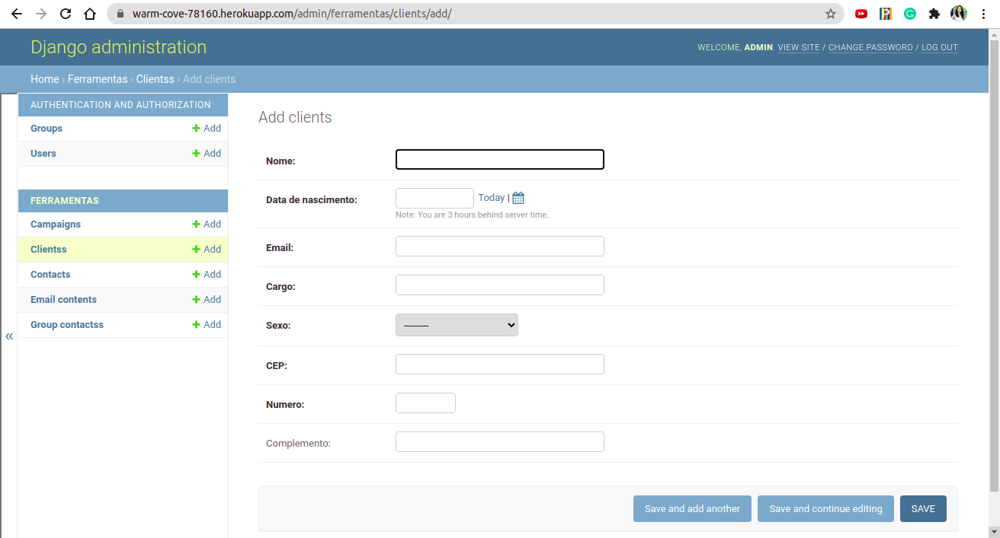
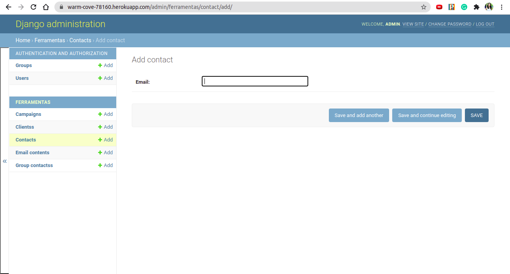
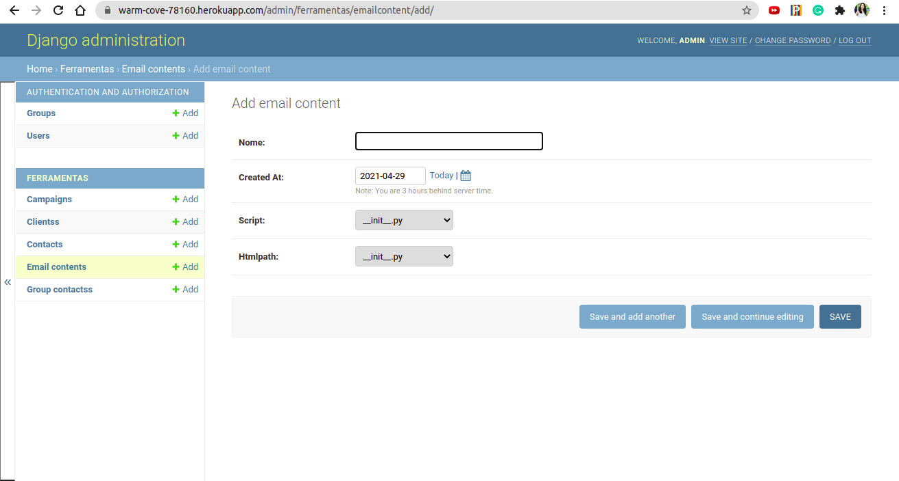
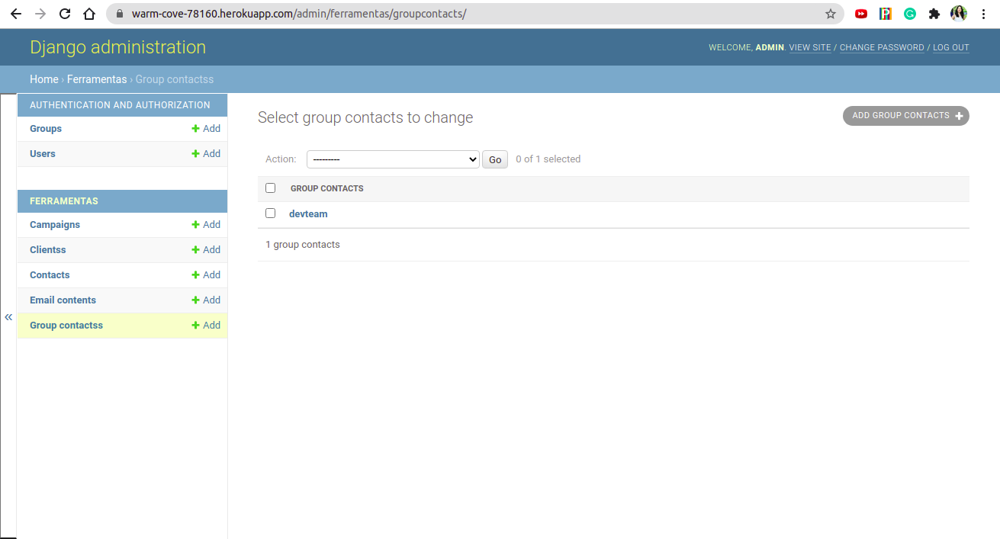

# Aplicação Email Marketing
## Projeto da disciplina de Engenharia de Software 
<h4 align="left"> 
	🚧  Email Marketing 🚀 Em construção...  🚧
</h4>

Tabela de Conteúdos
=================
<!--ts-->
   * [Sobre](#Sobre)
   * [Funcionalidades](#Funcionalidades)
   * [Como usar](#como-usar)
      * [Pré-requisitos](#pre-requisitos)
      * [Backend](#backend)
      * [Criar usuário](#criar-usuario)
      * [Acessando a aplicação](#acessando-a-aplicacao)
   * [Testes](#testes)
   * [Tecnologias](#tecnologias)
   * [Membros do Projeto](#membros-do-projeto)
<!--te-->

---
## Sobre
A aplicação consiste no desenvolvimento de um sistema de gerenciamento de email marketing, permitindo o envio de propagandas personalizadas para a lista de e-mails do público-alvo. O sistema deve extrair métricas de participação do público-alvo, como “quantas pessoas leram o e-mail?” e “quantas clicaram em hyperlinks?”. O sistema deve respeitar a LGPD, sendo assim, o armazenamento de dados realizados pelo sistema não deve conter quaisquer dados considerados sensíveis.

---
## Funcionalidades
- [x] Cadastrar clientes
- [x] Criar listas de email
- [x] Adicionar, excluir e editar conteúdos de marketing
- [x] Criar e excluir campanhas
- [ ] Obter informações sobre entrega, leitura, cliques e redirecionamento de e-mails
- [ ] Coletar métricas
- [ ] Gerar relatórios

---
## Como usar
O sistema de email marketing encontra-se na fase de desenvolvimento do backend, porém você pode rodar localmente ou acessar o deploy realizado na plataforma Heroku através deste [link](https://warm-cove-78160.herokuapp.com/admin/login/?next=/admin/). Neste caso, utilize as credenciais de acesso:
> login: admin
> password: grupo2

### Pré-requisitos
Antes de começar, você vai precisar ter instalado em sua máquina as seguintes ferramentas: Git, Python. Além disto é bom ter um editor para trabalhar com o código como VSCode.

### Backend
```bash
# Clone este repositório
$ git clone https://github.com/glauberiano/proj_eng_software

# Acesse a pasta do projeto no terminal/cmd
$ cd proj_eng_software

# Vá para a pasta emailmarketing
$ cd emailmarketing

# Instale as dependências
$ pipenv install

# Execute a aplicação em modo de desenvolvimento
$ python manage.py runserver

# O servidor inciará na porta:8080 - acesse http://localhost:8080/admin 
```

### Criar usuário
Para conseguir logar, você precisará criar um usuário admin. No terminal:
```bash
# Execute o comando para criar um usuário
$ python manage.py createsuperuser

# Crie um nome de usuário
Username: admin

# Insira um email deste usuário
Email address: admin@example.com

# Crie uma senha
Password: **********
Password (again): *********
Superuser created successfully.
```

### Acessando a aplicação
Acesse http://localhost:8080/admin e insira as credenciais de acesso que você acabou de criar. 

Na página inicial, é possível visualizar todas as opções de gerenciamento de usuários e de ferramentas do sistema.
<p align="center">
  
</p>

Para criar um novo usuário do sistema, clique em Users e insira as informações necessárias:
<p align="center">
  
</p>

Na aba Ferramentas, a opção Campanhas permite configurar a criação de novas campanhas, adicionando status, datas de início e término, assuntos, conteúdo de email e listas de emails:
<p align="center">
  
</p>

A opção Clients permite visualizar e criar novos clientes na plataforma:
<p align="center">
  
</p>

De volta ao menu principal, abaixo está a opção Contacts que permite adicionar novos endereços de email:
<p align="center">
  
</p>

Em Email Contents, é possível criar o corpo do email marketing que será disparado nas campanhas.
<p align="center">
  
</p>

Para criar um novo usuário do sistema, clique em Users e insira as informações necessárias:
<p align="center">
  
</p>

Para facilitar, é possível criar listas de endereços de emails na aba Group Contacts:
<p align="center">
  
</p>

---
## Testes

🚧 To do 🚧

---
Tecnologias
O desenvolvimento deste projeto utiliza as seguintes ferramentas:
 * Python 3.8
 * Django
 * Djangorestframework
 * SQLite
 * dotENV
 * BeautifulSoup4

---
# Membros do Projeto
- Caroline Dantas
- Fabiana Iegawa
- Leonardo Henrique
- Lucas Mazim
